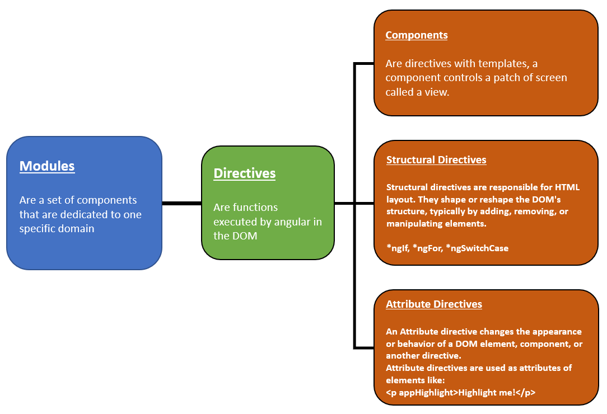
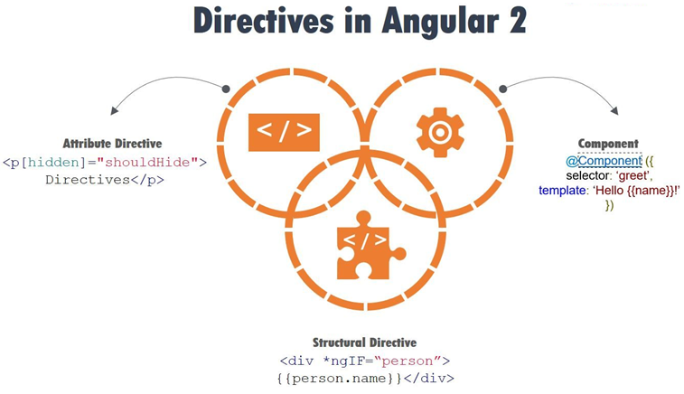
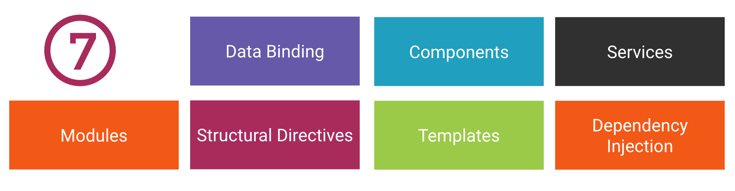
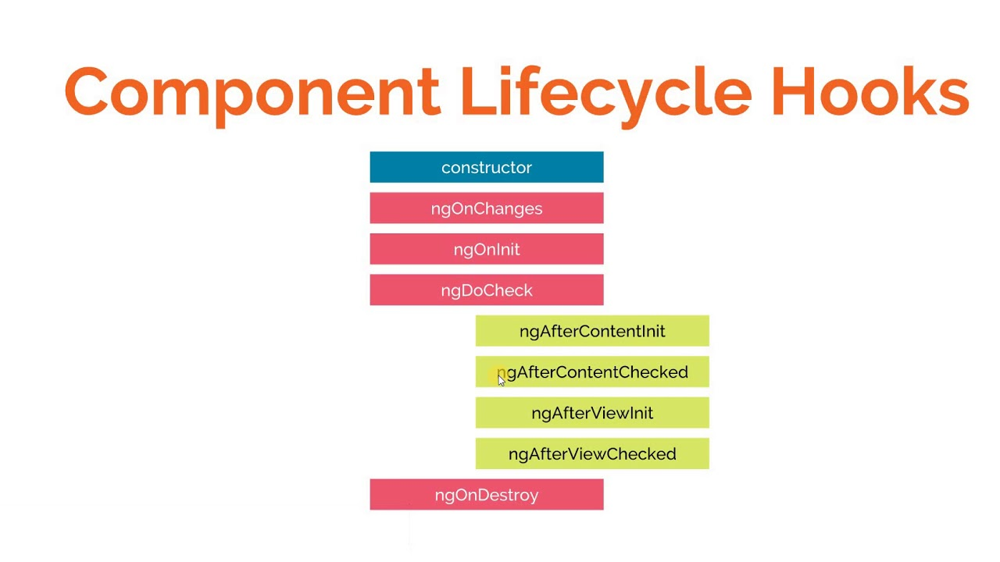

# Angular (CLI)
---
* [Angular Basic Structure](#angular-basic-structure)
* [Angular Directive Types](#angular-directive-types)
* [7 Keys to Angular 2](#7-keys-to-angular-2)
* [Angular Building blocks](#angular-building-blocks)
* [Angular Component lifecycle hooks](#angular-component-lifecycle-hooks)

---
### Angular basic structure

---
### Angular Directive Types

---
### 7 Keys to Angular 2

https://johnpapa.net/17-minute-angular-2-app/

---
### Angular building blocks

---
### Angular Component lifecycle hooks
